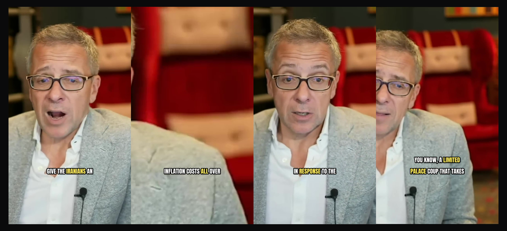
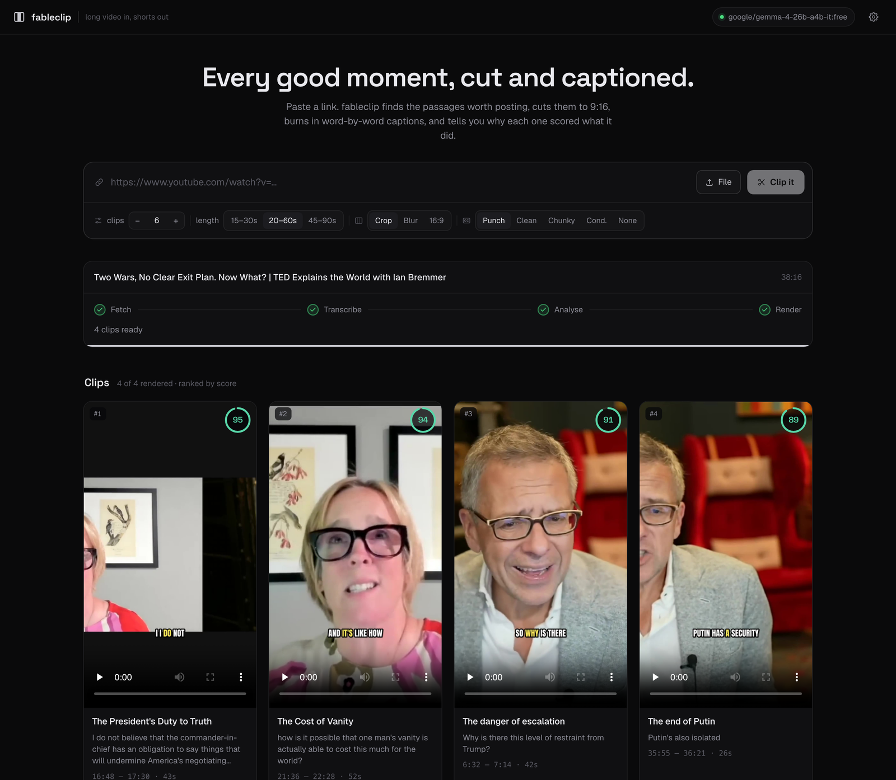

# fableclip

**A self-hostable replacement for [OpusClip](https://www.opus.pro) ($15/mo Starter, $29/mo Pro).**
Their free tier watermarks your captions and deletes your media after three days.
Paste a long video. Get vertical, captioned shorts, ranked by how likely each one is to travel — and told, in plain numbers, why. Runs against a model you own: free hosted, or fully local with no signup.

> Part of [Openware](https://github.com/openwarehq) — one repo per tool, each a real,
> self-hostable replacement for something overpriced. Not affiliated with OpusClip.



<sub>Four clips cut from one 38-minute TED interview, unedited and unretouched. Captions are burned in word by word — the spoken word is coloured, and numbers stay accented so a specific reads before the highlight reaches it. The framing is automatic: three of these found the speaker, the second found the armchair. That ratio is the honest one, and the focus slider is one drag.</sub>

---

## Read this before you run it

**The model never writes a timestamp.**

That is the whole design. Every line of the transcript is numbered, the model is asked which line a clip starts and ends on, and TypeScript does the arithmetic. Ask a 7B model for `01:42:17` and it will happily give you one — for a moment that does not exist. An integer it copied off the page is not a guess, and a line number that is out of range is a validation failure rather than a clip of the wrong thing.

Six more decisions follow from the same instinct — let the model do taste, and let code do everything that can be measured:

- **The score is arithmetic you can read.** The model rates six named things 0–10 — hook, payoff, emotion, clarity, quotability, novelty. Code weights those into a base, then applies modifiers for the things models are bad at judging and arithmetic is good at: length against a curve, words per second, whether the clip opens on a dangling "And so it..." , whether it ends mid-sentence, how much of it is "um". Every contribution is shown on the card. A score with no visible reasoning is a horoscope.
- **Captions come from the video, not from a GPU.** YouTube's machine caption track carries a **per-word timestamp** — `tOffsetMs` on every word, in a format called `json3`. That is a complete word-level alignment, free, in about a second. A 38-minute talk came back with 1,837 caption events and word timings throughout. Whisper is the fallback for when there is nothing to borrow, not the default.
- **Every render is checked by rendering.** There are 565 tests. Twelve of them run real ffmpeg: they build a source, cut a clip, and look at the file that comes out. That is how the blur mode was found to be broken — a filter graph ffmpeg rejects outright, which every argument-checking test sailed past. One of them renders the same frame with captions and without and asserts the two differ, because a wrong font name makes libass draw *nothing* while ffmpeg still exits 0.
- **The crop points at whoever is talking, shot by shot.** Not face tracking — it samples a dozen postage-stamp greyscale frames and centres the 9:16 window on the columns carrying the most motion and detail. On a side-by-side interview a centre crop lands on the seam between the two people; this picks the one speaking, and re-picks at every shot change via a time-varying crop expression rather than a re-encode per shot. The same sample finds the source's *own* letterbox — a Zoom tile inside a 16:9 frame — and crops past it, which `cropdetect` cannot do because the two tiles together fill the frame.
- **Clips are cut, not just sliced.** Every clip snaps to the first and last spoken word, so none opens or closes on silence, and any pause longer than 1.4s is spliced out with a beat left either side. The captions are rebuilt on the *output* timeline, because removing two seconds of dead air at 0:08 moves every word after it. Measured honestly: the TED interview used here is edited tightly enough that **its longest gap is 0.72s**, so nothing was spliced out of it at all — the splicer earns its keep on recordings, not on finished productions.
- **A clip you edit is a clip that gets re-cut.** Change the trim and the caption words are re-derived from the stored transcript and the score is recomputed, because length and opening line are two of the things it measures. Saving without re-rendering would leave a card describing a file that no longer matches it, so the editor does both or neither.

## What it does

- Paste a YouTube link — or any link yt-dlp handles — or upload a file
- Finds the passages worth posting, with overlapping analysis windows so a clip straddling a boundary is still seen whole
- Ranks them 0–100, with the full breakdown on every card
- Cuts to **1080×1920**, with three reframes: **crop** (auto-pointed at the speaker, with a slider to overrule it), **blur fit** for slides and two-shots, or untouched **16:9**
- Burns in **word-by-word captions** — the active word changes colour as it is spoken, numbers stay accented so "$600 AN OUNCE" reads before the highlight reaches it, filler is dropped from the text, and no line is left with one word stranded on it
- **Four caption styles**, from bundled OFL fonts, so a clip looks the same on your Mac as in the container
- Loudness-normalised audio at the level every platform targets, so your clip is not quietly turned down on upload
- An editor: nudge the in and out points, change the reframe, move the focus, swap the caption style, re-cut in seconds
- Download the MP4, or a `.srt` grouped for an editor rather than for a phone screen
- Every run kept on your machine in one SQLite file and one folder you can delete

## What it doesn't do

- **No face tracking, and it shows.** The auto-focus reads motion and detail, not faces. Measured on the four clips in the picture above: **three are framed on the speaker, one is framed on the armchair beside him** — a high-contrast, high-detail object that the heuristic likes as much as a face. It also cannot follow anyone *within* a shot, and a picture-in-picture inset will win the frame over the full-size speaker behind it. One drag of the focus slider fixes any of these, and moving the slider turns the automatic framing off for that clip.
- **Filler is removed from the captions, not the audio.** You still hear the "um"; you just do not read it. Cutting individual filler words out of a sentence sounds worse than leaving them in.
- **No b-roll, no zooms, no music, no stock footage, no AI voice.** It cuts what is there.
- **No speaker diarisation.** The transcript knows what was said, not who said it. (YouTube's `>>` speaker marks are used as segment boundaries, which is as far as it goes.)
- **No emoji or animated caption effects.** Colour-change karaoke, four fonts. Scaling the active word was tried and removed: ASS re-lays the line out every frame, so a wider active word shoves everything after it sideways and the caption twitches for the length of the clip.
- **It cannot tell you what will go viral.** Nothing can. It gives a defensible, explained ranking of the moments in *this* video against each other — that is a genuinely useful thing and it is a different thing.
- **The image is large** (1.6 GB, measured): ffmpeg, Python, and faster-whisper. That is what a video tool weighs.
- **Whisper's first run downloads its weights** (~145 MB for `base`), once, into the mounted volume. Free, but not offline the very first time that path is taken. The caption path — which is most videos — never touches it.

---

## Quickstart

```bash
git clone https://github.com/openwarehq/fableclip
cd fableclip
cp .env.example .env
docker compose up
```

Open <http://localhost:4325>, click the model chip to connect one — pick a provider, paste a free key, done. Or run without Docker:

```bash
npm install
npm run dev
```

**If port 4325 is already taken**, both paths take an override rather than making you edit a file:

```bash
PORT=4326 docker compose up
PORT=4326 npm run dev
```

Running outside the container needs `ffmpeg` and `yt-dlp` on your PATH (`brew install ffmpeg yt-dlp`), and `pip install faster-whisper` only if you want the no-captions path. fableclip names whichever one is missing instead of failing with `spawn ENOENT`.

## Bring your own model

Three variables, in a `.env` you copy from `.env.example`:

```bash
LLM_BASE_URL=https://openrouter.ai/api/v1
LLM_MODEL=google/gemma-4-26b-a4b-it:free
LLM_API_KEY=
```

**How many requests a run costs:** one per analysis window. A window is about 9,000 characters of transcript. Measured: a 38-minute interview — 6,374 words — took **six requests**. A ten-minute video is a single request. That matters on a free tier — OpenRouter allows 50 requests a day, Google AI Studio 20. Set `LLM_WINDOW_CHARS` higher to spend fewer requests on a model with a large context window.

Everything else in the app — re-trimming, re-rendering, changing caption style, changing the crop — costs **nothing**. The model is asked once, at the start; every edit after that is ffmpeg and arithmetic.

## Settings worth knowing

| Variable | Default | What it does |
|:--|:--|:--|
| `LLM_WINDOW_CHARS` | `9000` | Transcript per model request. Raise it on a big-context model to spend fewer requests |
| `WHISPER_MODEL` | `base` | `tiny`, `base`, `small`, `medium`. Only used when a video has no captions |
| `WHISPER_COMPUTE` | `int8` | `int8` is about twice the speed of `float32` on a CPU, with word timings you cannot tell apart |
| `PORT` | `4325` | Host port. The drop's number in the repo's sequence; override it if something else has it |
| `RENDER_CONCURRENCY` | `cores / 3`, capped at 3 | Clips cut at once. x264 already threads, so one per core makes every clip slower |
| `MEDIA_DIR` | `./data/media` | Source videos, rendered clips, thumbnails, Whisper weights |
| `DB_PATH` | `./data/fableclip.db` | One SQLite file |

Delete `data/` to reclaim every byte. Nothing lives anywhere else.

## How a run works

```
URL ──▶ fetch ──▶ transcribe ──▶ analyze ──▶ score ──▶ render ──▶ clips
        yt-dlp    captions          LLM      pure fn    ffmpeg
                  or whisper
```

Five named stages rather than one bar, because they take wildly different times and none can be predicted from the others. "Transcribing locally — this is the slow part" is honest about a three-minute wait in a way that "47%" is not.

One job at a time, in the web process. There is no Redis and no second container: "one command" is a rule of this repo, and a queue that needs its own service is a second command. The trade is real — work does not survive a restart — so a job left mid-flight by a restart is marked failed with a message saying exactly that, rather than sitting at 40% forever.

## Tests

```bash
npm test
```

565 tests, no network. 553 are pure logic — caption parsing against a real YouTube ASR file, transcript segmentation, quote matching, boundary snapping, overlap merging, every score modifier, auto-focus column analysis, ASS generation, ffmpeg argument construction, the store.

The other twelve run ffmpeg for real and inspect the output: correct dimensions, correct length, audio kept, silent sources handled, the blur graph accepted, captions visibly burned in, the focus slider actually moving the crop, a crop that *moves between shots* producing genuinely different frames, and a spliced clip coming back shorter with its audio and video still the same length. They skip themselves if ffmpeg is not installed rather than failing.

## Things that were measured, not assumed

- YouTube's `json3` auto-captions carry per-word `tOffsetMs`. Creator-*uploaded* caption tracks do not — they are one blob per line. So fableclip prefers the **machine** track over the human one, which is the opposite of what you would guess: better timing beats slightly better text, and timing cannot be recovered from a line.
- Asking yt-dlp for `--sub-langs "en.*"` requests roughly 200 machine translations and earns an **HTTP 429**. Exactly one language is requested, and `youtube:skip=translated_subs` keeps the metadata dump from being megabytes of translation URLs.
- Seeking with `-ss` *before* `-i` rather than after. On a 40-minute source, cutting from the last five minutes otherwise decodes and discards everything in front of it.
- Naming a filter output with `-map [v]` turns off ffmpeg's automatic stream selection **entirely**. Without an explicit `-map 0:a:0` alongside it, every clip comes out silent.
- The caption fonts are copied to `<media>/fonts` and referenced as `../fonts`. ffmpeg's filter parser treats `:` as an argument separator, so an absolute path — on a Mac, frequently one with a space in it — breaks the whole graph with an error that explains nothing.
- A word belongs to a clip if it *begins* inside it, not if it overlaps it. YouTube runs the last word of a caption event to that event's end, which reaches past where the next one starts — so with an overlap rule every clip opened on a stray tail word. "global And it's like how is it possible…" was a real caption, and the fragment also made the opening-line scorer dock the clip nine points for starting on a connective it never actually started on.
- Debian ships ffmpeg 5.1 and this Mac has 7.1. The crop, the blur graph and the caption burn-in were each run on both before this shipped.
- Escaping a comma **and** quoting the expression around it is not belt-and-braces — it is broken. `select='between(t\,0\,2)'` leaves literal backslashes inside the expression and ffmpeg rejects the whole graph with "Error opening output files: Invalid argument". Escape or quote, never both.
- The audio timebase constant is `TB`, not `STB`. `asetpts=N/SR/STB` fails with "Undefined constant or missing '(' in 'STB'" — which is a good error, unlike most of them.

---



<sub>One page. The pipeline strip names the stage rather than guessing a percentage; every card carries its score, and "Why" opens the six judgements and five modifiers that produced it.</sub>

---

<sub>MIT. Take it, host it, fork it, sell it.</sub>
